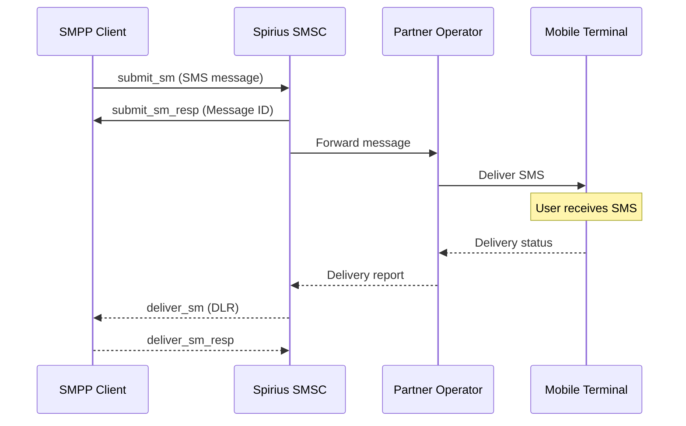
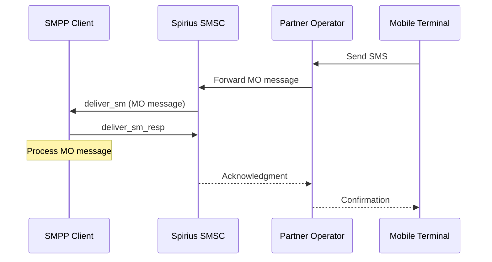

# SMPP Traffic Flows

This document describes the Short Message Peer-to-Peer (SMPP) protocol traffic flows used in the Spirius SMS platform, including both Mobile Terminated (MT) and Mobile Originated (MO) message flows.

## Overview

SMPP is a protocol used by SMS service providers to exchange SMS messages with Short Message Service Centers (SMSCs). The Spirius platform acts as an SMSC, facilitating message delivery between SMPP clients and mobile network operators.

## Traffic Flow Diagrams

### MT Traffic Flow (Mobile Terminated)



### MO Traffic Flow (Mobile Originated)



## MT Traffic Flow (Mobile Terminated)

Mobile Terminated (MT) traffic refers to messages that are sent **to** mobile devices. This is the most common use case for bulk SMS services, marketing messages, and notifications.

### Flow Steps:

1. **Message Submission**: The SMPP client connects to the Spirius SMSC and submits messages using `submit_sm` PDUs
2. **Message Processing**: Spirius SMSC processes the message, performs routing decisions, and validates the message
3. **Operator Delivery**: The message is forwarded to the appropriate partner mobile network operator based on the destination number
4. **Mobile Delivery**: The operator delivers the message to the target mobile terminal (end user's device)
5. **Delivery Reporting**: 
   - The mobile terminal sends delivery status back to the operator
   - The operator forwards delivery reports to Spirius SMSC
   - Spirius SMSC sends delivery reports back to the SMPP client via `deliver_sm` PDUs

### Key Characteristics:
- **Direction**: SMPP Client → Spirius SMSC → Operator → Mobile Terminal
- **Primary PDU**: `submit_sm` (client to SMSC)
- **Delivery Reports**: `deliver_sm` (SMSC to client) containing delivery status
- **Use Cases**: Marketing SMS, notifications, alerts, OTP messages

## MO Traffic Flow (Mobile Originated)

Mobile Originated (MO) traffic refers to messages that originate **from** mobile devices and are delivered to SMPP clients. This enables two-way SMS communication and interactive services.

### Flow Steps:

1. **Message Origination**: A mobile user sends an SMS from their device
2. **Operator Processing**: The mobile network operator receives the message and determines routing
3. **SMSC Delivery**: The operator forwards the message to Spirius SMSC
4. **Client Delivery**: Spirius SMSC delivers the message to the appropriate SMPP client using `deliver_sm` PDUs
5. **Acknowledgment Chain**:
   - SMPP client sends `deliver_sm_resp` to acknowledge receipt
   - Spirius SMSC acknowledges to the operator
   - Operator confirms delivery to the mobile terminal

### Key Characteristics:
- **Direction**: Mobile Terminal → Operator → Spirius SMSC → SMPP Client
- **Primary PDU**: `deliver_sm` (SMSC to client)
- **Response PDU**: `deliver_sm_resp` (client to SMSC)
- **Use Cases**: Customer replies, survey responses, interactive services, keyword-based services

## SMPP Connection Modes

The Spirius SMPP platform supports different connection modes depending on your traffic requirements:

### 1. Transmitter Mode (TX) - MT Traffic Only
**Use Case**: Send messages only (no receiving capability)

- **Bind Type**: `bind_transmitter`
- **Capabilities**: Can send MT messages via `submit_sm`
- **Limitations**: Cannot receive MO messages or delivery reports
- **Best For**: One-way bulk SMS campaigns, notifications where delivery reports are not required

### 2. Receiver Mode (RX) - MO Traffic Only  
**Use Case**: Receive messages only (no sending capability)

- **Bind Type**: `bind_receiver`
- **Capabilities**: Can receive MO messages and delivery reports via `deliver_sm`
- **Limitations**: Cannot send MT messages
- **Best For**: Dedicated MO message processing, keyword services, customer service applications

### 3. Transceiver Mode (TRX) - Full Bidirectional
**Use Case**: Both sending and receiving (recommended for most applications)

- **Bind Type**: `bind_transceiver`
- **Capabilities**: 
  - Send MT messages via `submit_sm`
  - Receive MO messages via `deliver_sm`
  - Receive delivery reports via `deliver_sm`
- **Best For**: Interactive SMS applications, two-way communication, applications requiring delivery reports

## Connection Examples

### MT-Only Connection (Sending Only)
```python
# Connect in transmitter mode for sending only
client.bind_transmitter(system_id=username, password=password)

# Send messages
client.send_message(
    source_addr="YourBrand",
    destination_addr="46701234567",
    short_message="Your message here"
)
```

### MO-Only Connection (Receiving Only)
```python
# Connect in receiver mode for receiving only
client.bind_receiver(system_id=username, password=password)

# Set up message handler for incoming MO messages
client.set_message_received_handler(handle_mo_message)
client.listen()
```

### Full Bidirectional Connection (MT + MO)
```python
# Connect in transceiver mode for both sending and receiving
client.bind_transceiver(system_id=username, password=password)

# Send messages and receive MO messages + delivery reports
client.set_message_received_handler(handle_mo_and_dlr)
client.set_message_sent_handler(handle_sent_confirmation)

# Send message
client.send_message(...)

# Listen for incoming messages
client.listen()
```

## Protocol Details

### Key SMPP PDUs Used

| PDU Type | Direction | Purpose |
|----------|-----------|---------|
| `bind_transmitter` | Client → SMSC | Establish TX-only connection |
| `bind_receiver` | Client → SMSC | Establish RX-only connection |
| `bind_transceiver` | Client → SMSC | Establish bidirectional connection |
| `submit_sm` | Client → SMSC | Submit MT message for delivery |
| `submit_sm_resp` | SMSC → Client | Confirm message submission |
| `deliver_sm` | SMSC → Client | Deliver MO message or delivery report |
| `deliver_sm_resp` | Client → SMSC | Acknowledge MO message receipt |
| `unbind` | Either direction | Gracefully close connection |

### Message Types in deliver_sm

When receiving `deliver_sm` PDUs, they can contain:

1. **MO Messages**: Actual SMS messages sent by mobile users
   - Contains message text in `short_message` field
   - Source address is the mobile number
   - Destination address is your service number

2. **Delivery Reports**: Status updates for previously sent MT messages
   - Contains delivery status information
   - May include message ID correlation
   - Status values: DELIVRD, UNDELIV, REJECTD, etc.

## Security and Connection Options

### Plain TCP Connection
- **Port**: Typically 2775 (configurable)
- **Security**: No encryption
- **Use Case**: Internal networks, testing environments

### SSL/TLS Connection  
- **Port**: Typically 2776 (configurable)
- **Security**: Encrypted communication
- **Use Case**: Production environments, internet-facing connections
- **Recommended**: For all production deployments

## Best Practices

1. **Connection Management**:
   - Use `bind_transceiver` for most applications
   - Implement proper connection pooling for high-volume applications
   - Handle connection failures with automatic reconnection

2. **Message Handling**:
   - Always acknowledge MO messages with `deliver_sm_resp`
   - Implement proper message correlation for delivery reports
   - Handle different character encodings (GSM 7-bit, UCS2, etc.)

3. **Error Handling**:
   - Monitor connection status and implement reconnection logic
   - Handle SMPP error codes appropriately
   - Implement message queuing for connection failures

4. **Security**:
   - Use SSL/TLS connections in production
   - Implement proper authentication and authorization
   - Monitor for unusual traffic patterns

## Testing with Spirius SMPP Tools

This repository provides tools to test both MT and MO traffic flows:

- **`smpp_sender.py`**: Test MT traffic by sending messages
- **`smpp_receiver.py`**: Test MO traffic by receiving messages
- **End-to-end testing**: Use receiver in "send-receive" mode to test complete MT→MO flow

For detailed usage instructions, see the main [README.md](../README.md) file.
